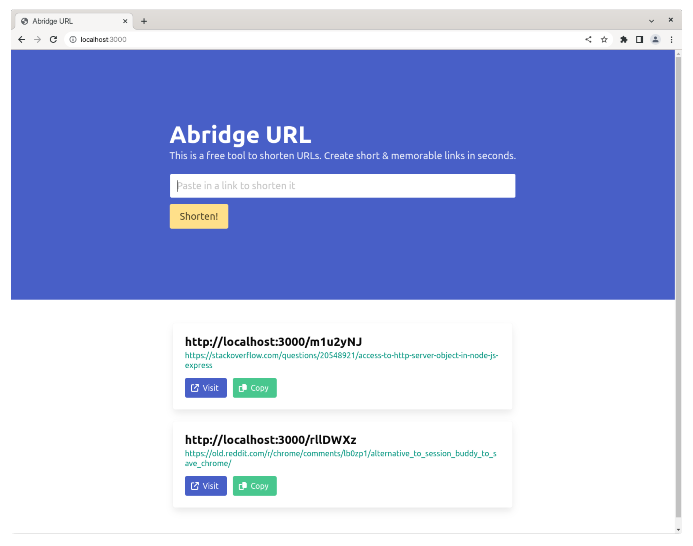

# Abridge URL

A URL Shortener Application built with Node.js, Express and MongoDB. See the
[fastify branch](https://github.com/finallyayo/node-url-shortener/tree/fastify)
for the Fastify version.

Tutorial:

## Prerequisites

You must have Node.js, npm and MongoDB installed on your machine. This project
was built against the following versions:

- Node v18.15.0
- npm v9.5.0
- MongoDB v6.0.5

## Getting started

- Clone this repository to your computer.
- `cd` into the project folder and run `npm install`.
- Rename `.env.sample` to `.env`.
- Run `npm run start:dev` to start the development server.
- Visit http://localhost:3000 in your browser to see the application in action.

## How to use

- Enter a URL into the input field and click **Shorten!**. The shortened URL
  will be displayed on the page.
- Click the **Visit** button to open the shortened URL in a new tab. It should
  redirect you to the original URL.
